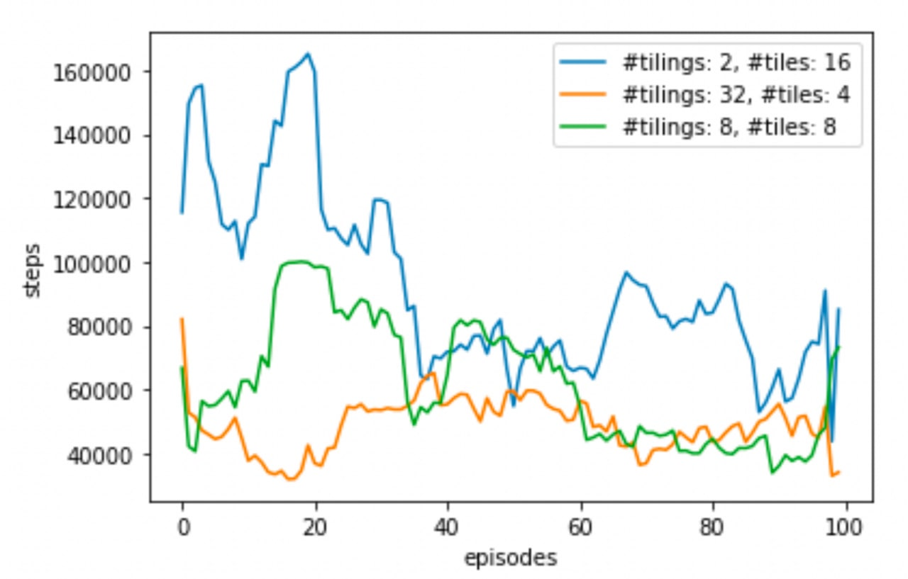

# ContinuousLearning

There are the implementation of two algorithm for continuous learning, the **Tile-Coding** and the **DQN** for two problems from https://www.gymlibrary.dev. We used **Sarsa** for policy selection. The report explained the details and a code from the primary steps of learning is provided too. 

First problem is the **Mountain-Car** and the second is **Lunar-Lander**.

The plot below is a comparison between different configurations for the Mountain-Car problem. 

More details are provided in the report.
